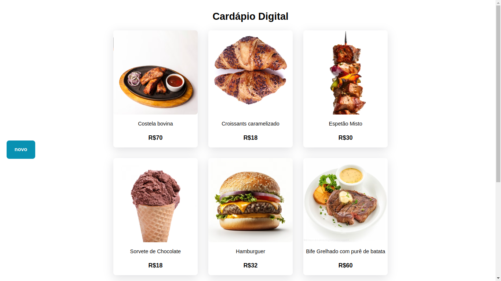
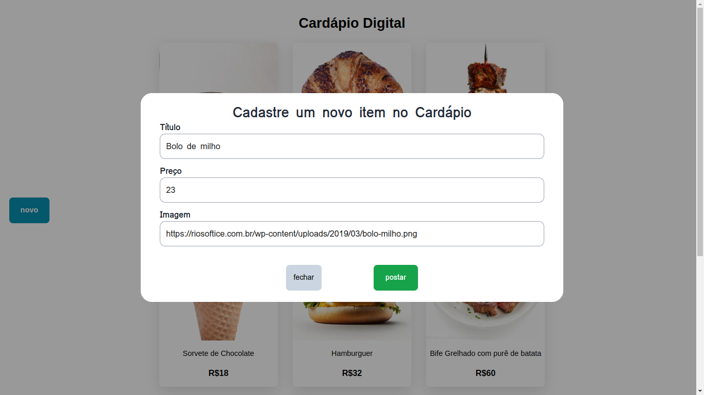

# CARDÁPIO-DIGITAL
**Front-End para API [cardápio-digital](https://github.com/lemuel-sousa/cardapio-digital)**

**Stack: React, Typescript, Tailwindcss e React Query**

🤝 Baseado no projeto desenvolvido por [@Fernanda Kipper](https://github.com/Fernanda-Kipper): [cardápio-digital](https://github.com/Fernanda-Kipper/frontend-cardapio-digital)

<h1 align="center">
    
    
</h1>

## 💻 Melhorias estão por vir ...